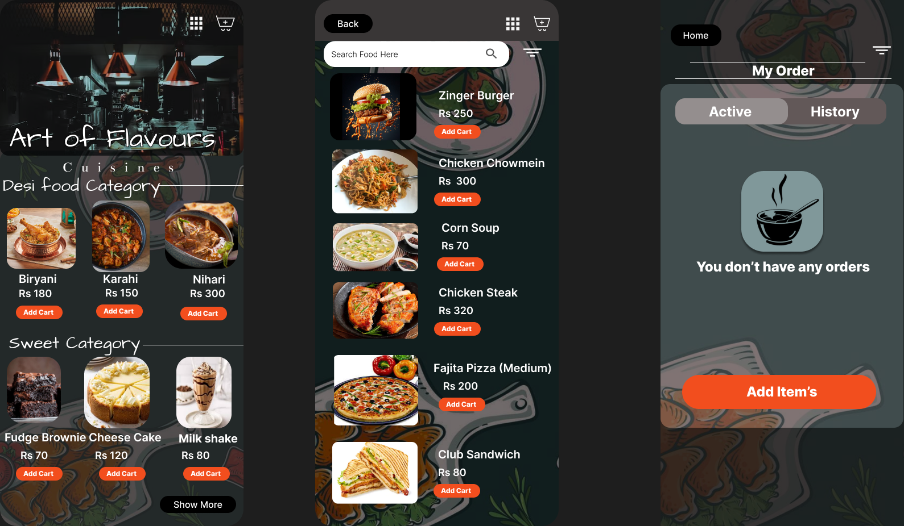

# mobile-restaurant-menu-ui
UI/UX design for a mobile restaurant menu and ordering app, featuring food categories, item listings, and an order history. Created in Figma.
# Mobile Restaurant Menu & Ordering App Design

This repository showcases a UI/UX design concept for a mobile application dedicated to browsing restaurant menus and placing orders. The design includes various food categories, detailed item listings, and an order management screen.

## 🖼️ Design Preview

---

## 🚀 Interactive Prototype

You can view and interact with the live Figma prototype to explore the app's flow and features.

  <a href="https://www.figma.com/proto/Ai8ae06Pp4R9ywugaynPpb/Resturant-Menu--Community-?t=06Lu8O1RuilkYKcp-1&scaling=scale-down&content-scaling=fixed&page-id=0%3A1&node-id=2-10&starting-point-node-id=2%3A10">
    <strong>➡️ Open Interactive Figma Prototype</strong>
  </a>

---

## ✨ Key Screens & Features

* **Home/Menu Page:** Displays "Art of Flavours" with "Desi Food Category" and "Sweet Category" sections, allowing users to browse various dishes and desserts.
* **Item Listing Page:** Shows a detailed list of food items (e.g., Zinger Burger, Chicken Chowmein) with prices and an "Add Cart" button.
* **My Order Page:**
    * **Active Tab:** Displays current, pending orders.
    * **History Tab:** Shows past orders.
    * Includes a prominent "You don't have any orders" state with an "Add Item's" call-to-action when the cart is empty.

---

## 🛠️ Tools Used

* **Figma:** For UI/UX design and prototyping.
